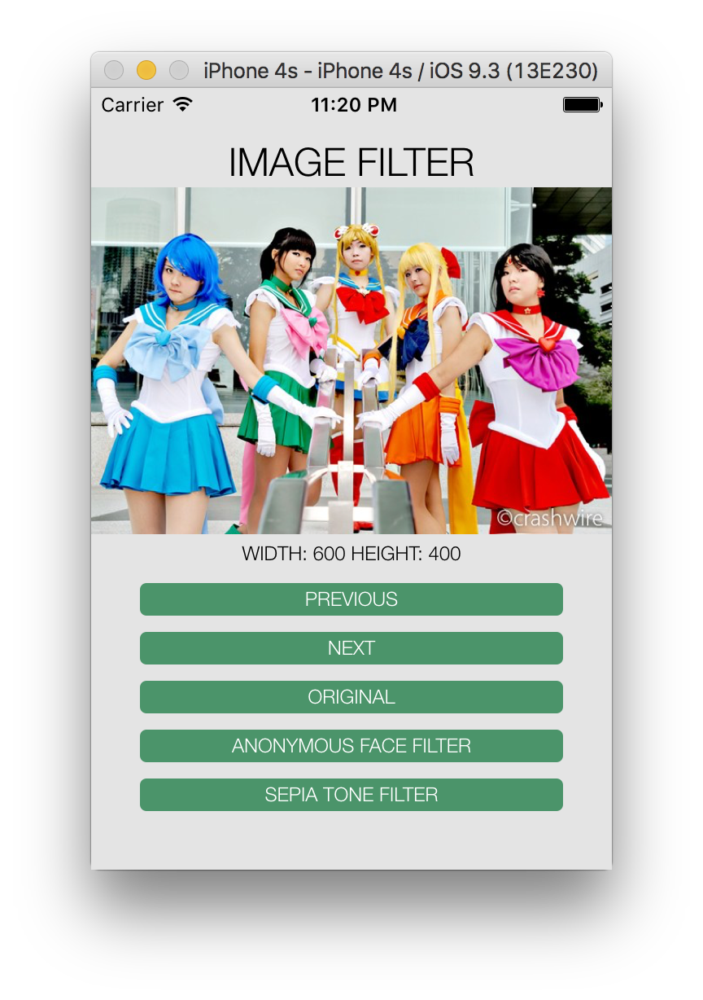
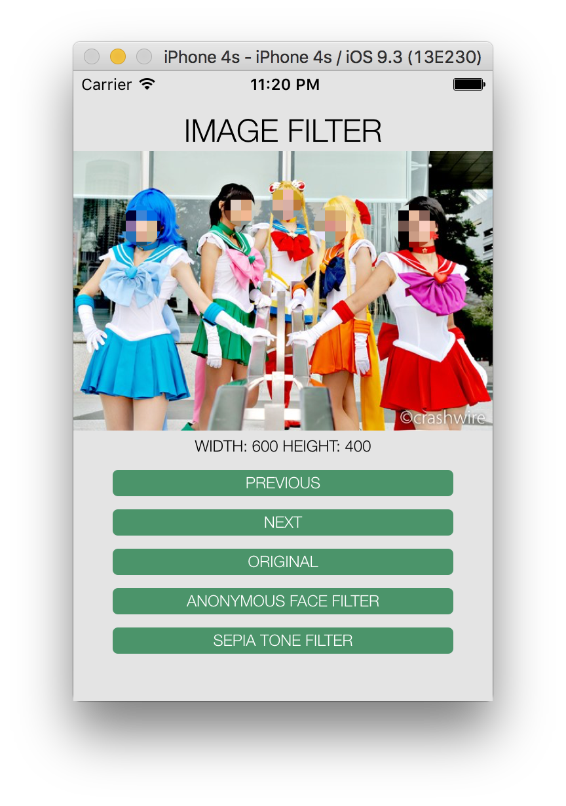
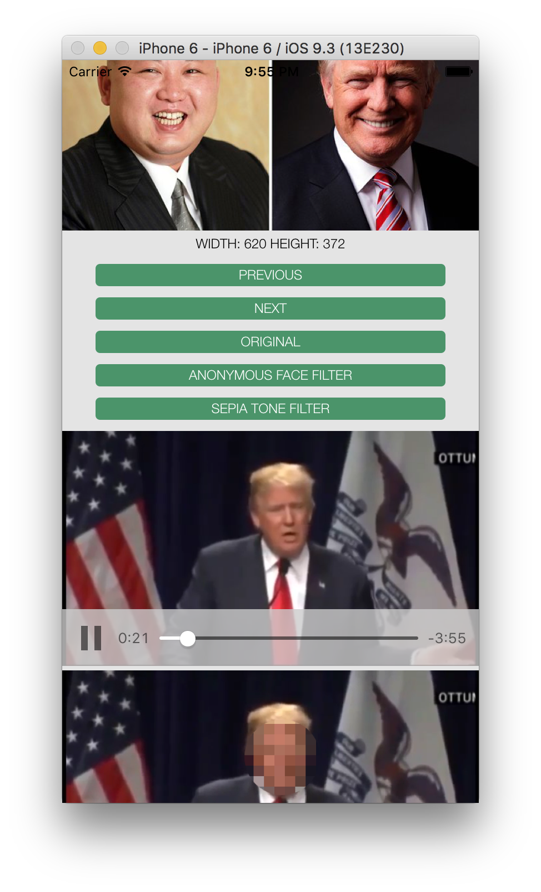
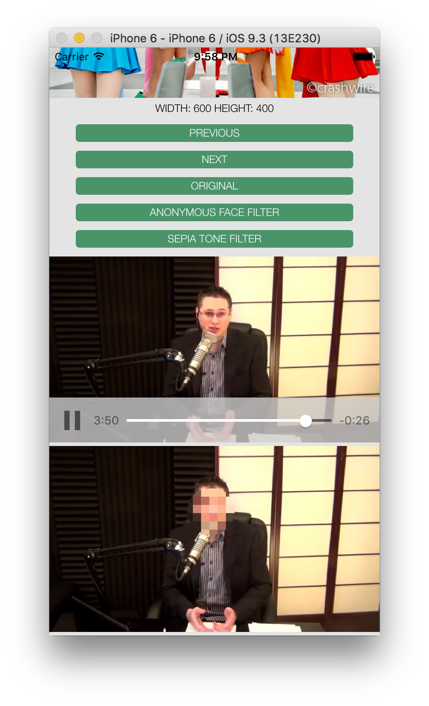

# imageFilter
Cordova plugin: image filter

This plugin provides some image filters (e.g. Anonymous face filter, Sepia tone filter).

This plugin defines a global `imageFilter` object, and a method `applyFilter`

```javascript
imageFilter.applyFilter(args, successCallBack, errorCallBack);
```
- args is an object and it contains
  * `srcUrl` - url of the source image
  * filter object that contains name of the filter, and optional filter options.  E.g. `{name:'SepiaTone', intensity: 0.7}`
  * by default, the filtered image will not saved on the device.  In case, the save copy is needed (e.g. for debugging), then can pass saveToDisk: true.  E.g.  `{name:'SepiaTone', intensity: 0.7, saveToDisk: true}`

- argument of successCallBack is url of the filtered image

## Example - Image
### HTML
```html

```
### Javascript
```javascript
var heroImage = document.getElementById('heroImg');
var anonymousFaceFilter = {name:'AnonymousFaces'};
var args = {srcUrl: heroImage.src, filter: anonymousFaceFilter};
var successCallBack = function(filteredImageUrl){
  heroImage.src = filteredImageUrl;
};
var errorCallBack = function() {
  console.log("something wrong");
};

imageFilter.applyFilter(args, successCallBack, errorCallBack);
```

## Example - Video (beta)
### HTML
```html
<video id="video" src="video/video1.mp4" controls="false" webkit-playsinline></video>

<!--
    To let webkit-playsinline (play canvas video inline) work on iOS,
    it is required to set allowsInlineMediaPlayback to true on the MainViewController.m

- (void)viewDidLoad
{
    [super viewDidLoad];
    // Do any additional setup after loading the view from its nib.
    ((UIWebView*) self.webView).allowsInlineMediaPlayback = true;
}
-->
```
### Javascript
```javascript
var video = document.getElementById('video');
var canvas = document.createElement("canvas");
var ctx = canvas.getContext('2d');
var videoImg = document.getElementById('videoImage');
var anonymousFaceFilter = {name:'AnonymousFaces'};

var adjustCanvasDimension = function() {
    canvas.width = this.videoWidth;
    canvas.height = this.videoHeight;
};
var applyAnonymousFaceFilterOnVideoBody = function() {
    ctx.drawImage(app.video, 0, 0, canvas.width, canvas.height);
    imageFilter.applyFilter({ srcUrl: canvas.toDataURL(), filter: anonymousFacesFilter },
        applyAnonymousFaceFilterOnVideoSuccessCB,
        applyAnonymousFaceFilterOnVideoFailCB);
};
var applyAnonymousFaceFilterOnVideoSuccessCB = function(filteredImg) {
    videoImg.src = filteredImg;
    setTimeout(applyAnonymousFaceFilterOnVideo);
};
var applyAnonymousFaceFilterOnVideoFailCB = function() {
    video.pause();
    console.log('imageFilter.applyFilter() failed');
};
var applyAnonymousFaceFilterOnVideo = function() {
    if (!video.paused && !video.ended) {
        applyAnonymousFaceFilterOnVideoBody();
    }
};

video.addEventListener('loadedmetadata', adjustCanvasDimension, false);
video.addEventListener('loadeddata', applyAnonymousFaceFilterOnVideoBody, false);
video.addEventListener('play', applyAnonymousFaceFilterOnVideo, false);
```

## Installation
```javascript
cordova plugin add kimberley-plugin-imagefilter
```

## Test App
A simple test app is included, please add ios platform before try

1. `cordova platform add ios`
2. `cordova prepare ios`
3. Use Xcode to try it or use `cordova run ...`

### Test App Screen - Image
| Before the anonymous face filter | After the anonymous face filter |
| --- | --- |
| [](test-app-screens/before-faceMask.png) | [](test-app-screens/after-faceMask.png) |

### Test App Screen - Video
| Anonymous face filter on video | Anonymous face filter on video |
| --- | --- |
| [](test-app-screens/videoMask.png) | [](test-app-screens/videoMask2.png) |


# Supporting platform
* iOS

# Coming soon ...
* More filters
* Other platform like Android

# Release note
## 0.0.4
* Option to save filtered image on device (default is not save)
* Reuse CIContext
* Test-app, apply ananoymous face filter on video (beta)
* Documentation update

## 0.0.3
* Documentation update

## 0.0.2
* Documentation update

## 0.0.1
* Initial
